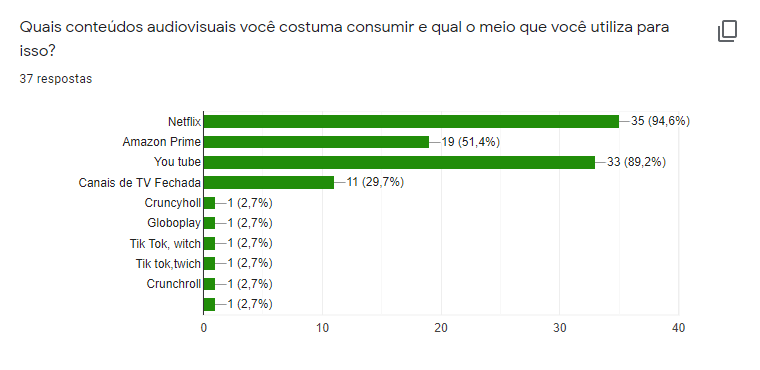
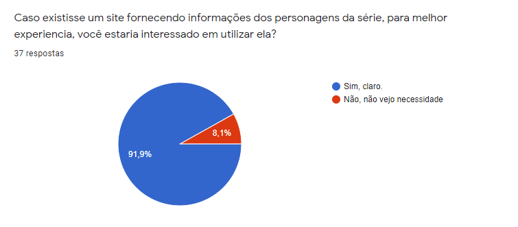
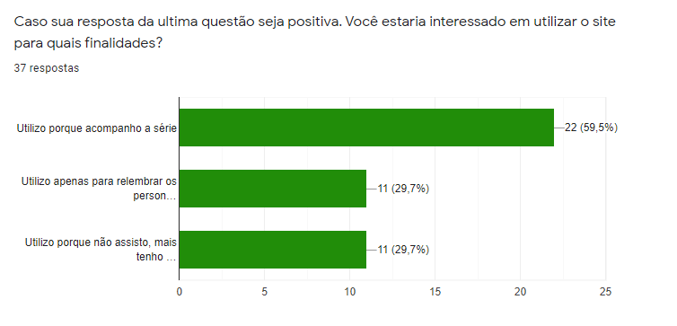
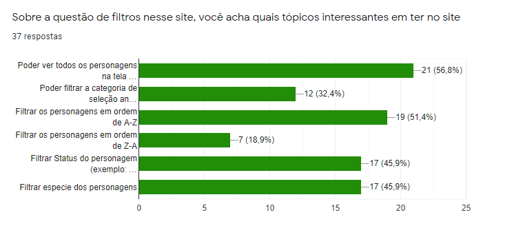
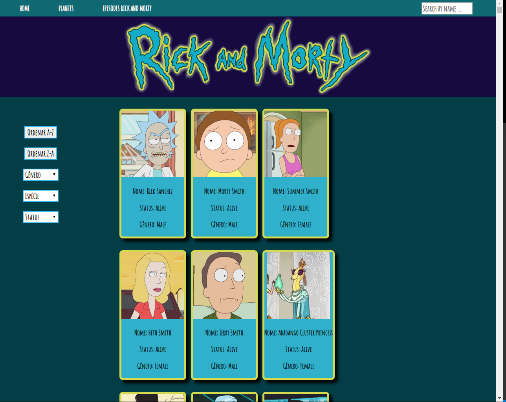
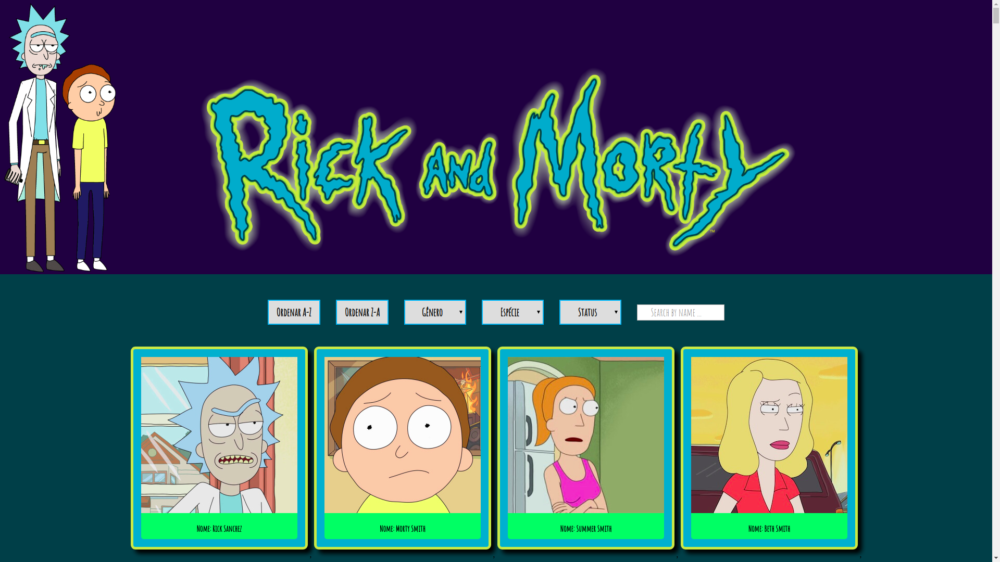
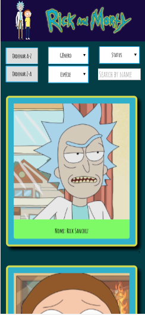
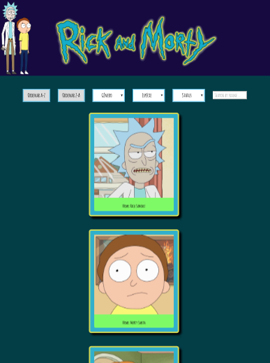

# Data Lovers

Rick and Morty Dashboard.

Acesse a página clicando [aqui](https://thalitagoncalves.github.io/SAP004-data-lovers/src/)

## Índice

* [1. Intodução](#1-introdução)
* [2. O Problema](#2-o-Problema)
* [3. Dataset](#3-dataset)
* [4. Usuário](#4-usuário)
* [5. Protótipo de Baixa Fidelidade](#5-protótipo-de-baixa-fidelidade)
* [6. Testes e Feedbacks de usabilidade](#6-testes-e-feedbacks-de-usabilidade)
* [7. Resultados](#7-resultados)
* [8. Ferramentas Utilizadas](#8-ferramentas-utilizadas)

***

## 1. Intodução

Bem vindo(a) a Dashboard de personagens da série **Rick e Morty**!

A série trata das aventuras de Rick Sanchez, um cientista brilhante (com sérios problemas de alcoolismo) e seu sobrinho Morty Smith (não tão brilhante) através de galáxias e realidades paralelas onde encontram todos os tipos de personagens estranhos e, inclusive, outras versões de si mesmos. Após vários episódios de aventuras (até a entrega desse projeto) foram introduzidos 493 personagens diferentes na série e, vamos ser sinceros, fica difícil acompanhar o destino de cada personagem - especialmente quando vários também se chamam Rick e Morty e acontecem inusitadas trocas de realidades!

Com isso em mente, criamos um banco de dados que usa informações fornecidas pela (Rick and Morty API)[https://rickandmortyapi.com/] para facilitar a busca de personagens da série e obter informações dos mesmos através de cards e opções de busca.

Para elaboração deste projeto, foi _necessário a construção de Histórias de Usuários_ para nos guiar em relação ao que deveria ser realizado e entregue neste projeto.

## 2. O Problema

A série Rick and Morty possui uma grande variedade de personagens, características bem diferentes para cada um, 4 temporadas e um tempo consideravelmente longo entre o lançamento de uma temporada e outra.

Para facilitar a vida dos consumidores dessa série, fizemos um Dashboard, que permite a busca pelo nome do personagem e uma interação através de cards e filtros específicos. O usuário pode, então, _filtrar seus personagens por gêneros, espécies e status existentes_. Mas não só isso! É possível ver o número de personagens relacionados à pesquisa dessas características quando filtrado.

## 3. Dataset

O Dataset utilizado foi o da série Rick and Morty, que contém informações diversas (nome, gênero, status, espécie, mundo de origem (localização), dentre outras informações menos relevantes para o objetivo deste projeto específico sobre todos os 493 personagens da série.

O objetivo principal deste projeto é que aprenda a desenhar e construir uma interface web onde se possa visualizar e manipular dados, entendendo o que o usuário necessita.

## 4. Usuário

### Formulário de Pesquisa do Usuário

Para atender as expectativas dos usuários, criamos um formulário de pesquisa, onde foi possível colher informações sucintas para criação do layout da página. Por meio de dados gráficos, podemos identificar o perfil dos nossos usuários:

### Historia de Usuário

#### História 1
_"Eu como usuário gostaria de ter visibilidade de todos os personagens da série na tela principal onde consiga ver em ordem alfabética"_

*Definição de pronto:* todos os personagens e suas características devem estar no index.html, no formato de cards.

*Critérios de aceitação:* quero visualizar os personagens em cards, e quero que estes contenham informações sobre os personganes, como imagem, nome, espécie, gênero, mundo de origem e status.

#### História 2

_"Eu como usuário quero poder clicar em um botão que me mostre os personagens que estão vivos e os que já morreram na série, a fim de me atualizar para assistir as próximas temporadas e relembrar o que já foi visto."_

*Definição de pronto:* O site deve ter uma tag select para que o usuário possa escolher se quer filtrar o personagem pelo gênero, espécie ou status. Ao ser selecionada alguma destas opções, deve ter disponíveis as sub-opções. Quando o usuário selecionar sua opção e clicar no botão de busca, o site deve gerar cards com os personagens que correspondem à busca do usuário.

*Critérios de aceitação:* Quero poder escolher o filtro, seja ele gênero, status e espécie. Quero que, quando esse filtro for selecionado, me apareçam as opções associadas a ele. Quero que me seja apresentado os personagens que satisfaçam as condições do filtro, em cards, com informações como imagem, nome, espécie, gênero, tipo, mundo de origem e status.

#### História 3

_"Eu como Como fã da série Rick and Morty, gostaria de poder buscar o personagem pelo nome."_

*Definição de pronto:* O site deve ter uma caixa de busca para que o usuário possa digitar o nome do personagem. A função que manipule este dado junto ao dataset deve ser capaz de buscar pelo personagem independente do usuário ter digitado com ou sem caixa alta, resultando na visualização dos personagens que correspondam ao input do usuário.

*Critérios de aceitação:* quero filtrar o usuário por nome, como eu não sei o nome completo dos personagens quero que a busca me traga resultados mesmo com parte do nome. Quero que a pesquisa me retorne todos os personagens sensíveis à minha busca, em cards, com informações como imagem, nome, espécie, gênero, tipo, mundo de origem e status.

#### História 4

_"Eu como usuário gostaria de poder visualizar estatisticamente informações de qualquer escolha específica quando clicar em algum filtro, por exemplo: Qual a porcentagem de humanoides na série?"_

*Definição de pronto:* O usuário deve ser capaz de visualizar o quantitativo em porcentagem das opções gênero, espécie e status.

*Critérios de aceitação:* Ao aplicar qualquer um dos filtros de status e especie o usuário escolhe a opção que desejar e o filtro calcula uma porcentagem da quantidade representativa em porcentagem da categoria que for escolhida.

## 5. Protótipo de Baixa Fidelidade

A partir das protopersonas e do banco de dados desenvolvemos um layout que acreditamso ser ideal para atender as requisições do usuário.

Para criar um dashboard, precisamos de cards para mostrar as informações de maneira clara e campos para o usuário interagir com os dados (inputs - botões - campos para digitação).

Utilizamos a ferramenta disponibilizada pelo site figma para construir o nosso protótipo de baixa fidelidade, que pode ser visualizado [aqui].(https://www.figma.com/file/sQVYqqUnz63VlEGrc9hjtb/Untitled)

Este foi o primeiro protótipo:

## 6. Testes e Feedbacks de usabilidade

Foram realizados testes de usabilidade com usuários diferentes, onde foi identificada a necessidade de exibir todos os cards, portanto optamos por ter apenas uma página inicial, contendo todos os cards para a visualização da imagem e nome do personagem e atrás do mesmo card as informações sobre as suas características principais, alterando assim, o layout da página web.

Para que a pesquisa pudesse ser feita pelo nome, inserimos campo para a digitação, fornecendo a possibilidade ao usuário ao digitar as primeiras letras do nome do personagem, aparecer a lista de opção para que o mesmo possa localizar seu personagem por preferência. Disponibilizamos pesquisa por gênero, status e também por espécie. 

Exibimos também uma parametro que ao clicar em determinado filtragem o usuário saberá em porcentagem quantos personagens dentre todos que aparecem na animação possuem determinada característica.

Este é o resultado final do layout:

> Versão para computadores.

#### Responsividade

Adequamos o site a ser _responsivo_, ou seja, ele pode ser visualizado sem problemas a partir de diversos tamanhos de tela: celulares, tablets, notebooks, etc. Abaixo imagens do layout:

> Versão para celulares e tablets.

## 7. Resultados

Aprendemos a desenhar e construir uma interface web onde se possa visualizar e manipular dados, entendendo o que o usuário necessita.

* Criamos histórias do usuário com base nas *necessidades*  de supostos fãs de Rick and Morty.
* As definitions of done e os critérios de aceitação estavam relacionados, para todas as histórias, em manipular o dataset, extrair dele as informações necessárias para a realização da tarefa, construção de funções para manipular estas informações, o retorno dos dados trabalhados para o usuário e por fim os testes unitários para as funções do arquivo data.js;
* Definimos quais dados utilizar como base no *entendimento do usuário*;
* Criamos responsividade para o layout da página para se adequar a outros dispositivos móveis (celulares, tablets e notebooks);
* Manipulamos *arrays e objetos*;
* Manipulamos o *DOM*;
* Manejamos os eventos *DOM* para permitir interação com o usuário (filtros e busca);

## 8. Ferramentas Utilizadas

* JavaScript
* HTML 5
* CSS
* Node.JS
